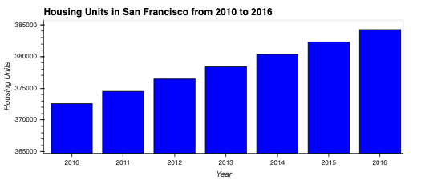

# San Francisco Property Analysis

The project included in the repository analyses data in the San Francisco property market from 2010 to 2016. 

#### Section One
The first section of the analysis includes a calculations and visual bar chart representation of the volume of housing units built in the respective timeframe. This is determine the supply growth of housing in the area. 

#### Section Two
The second section of the analysis calcuates and visually represents the average sale price per square foot and the acerage gross rent in the entire data set.  This is to determine a general idea of the prices in the area.

#### Section Three
The third section of the analysis calcualte and visually represents the average sale price per square foot and the average gross rent in each respective neighborhood. This is used to determine a more specific understanding of the property market. 

#### Section Four
The fourth section utilises the data from section one and three and combines them and overlays them on a geographical plot. This creates and interactive chart to make analysis on the property market with ease. 

